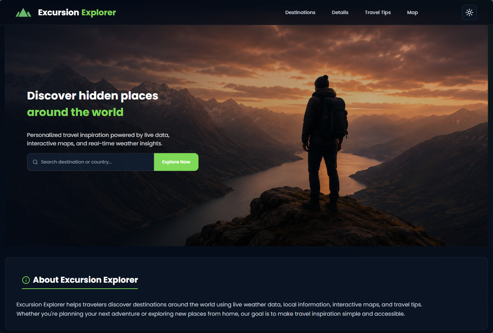
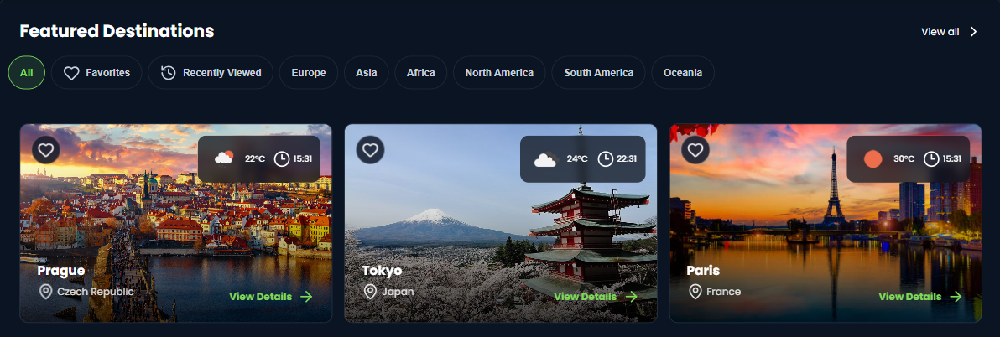
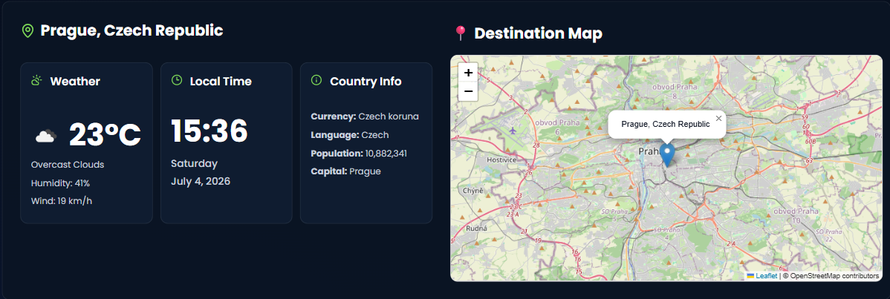
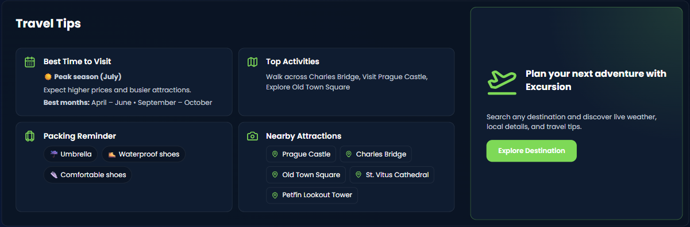
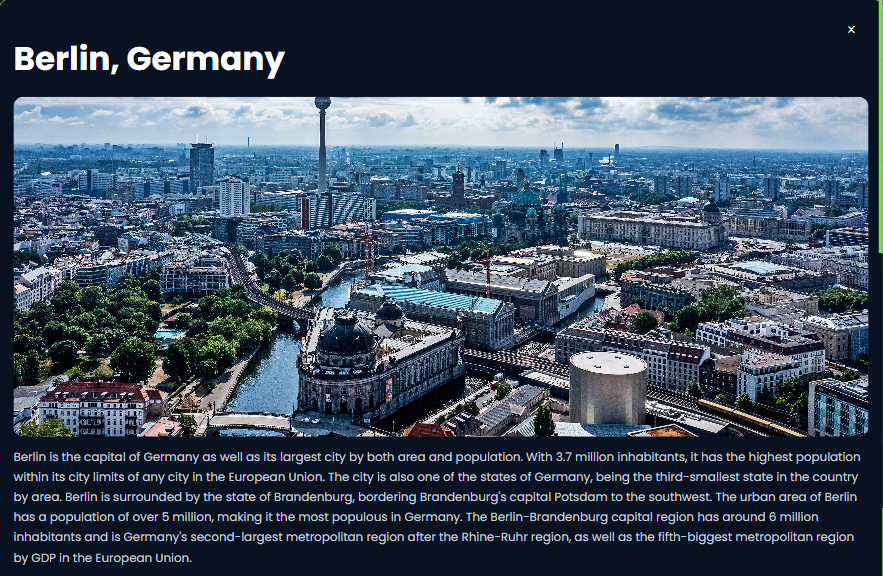
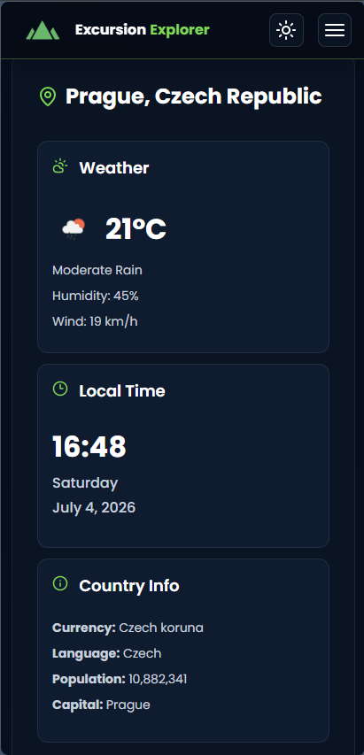
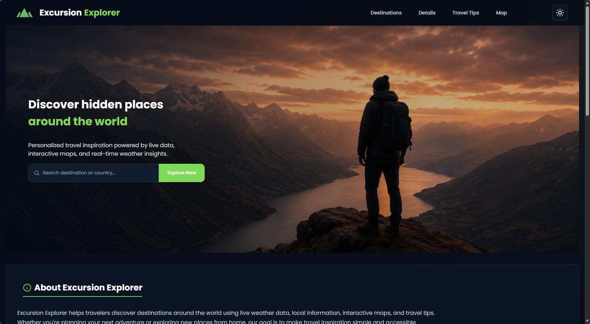

<p align="center">
  
</p>

<h1 align="center">🌍 Excursion Explorer</h1>

<p align="center">
  A modern and responsive travel discovery web application that helps users explore destinations worldwide using live weather data, interactive maps, destination information, travel tips, and global search.
</p>

<p align="center">
  
  
  
  
  
  
  
  
</p>

<p align="center">
  
  
  
</p>

<p align="center">
  <a href="https://amirabenameur3.github.io/Excursion-explorer/">
    
  </a>
</p>

---

# 📖 Project Overview

Excursion Explorer is a modern front-end travel application designed to help users discover destinations around the world through real-time information and interactive exploration.

The application combines multiple public APIs to provide live weather, local time, destination summaries, interactive maps, nearby attractions, and personalized travel tips within a clean and responsive interface.

The project evolved from a simple featured-destinations page into a modular travel explorer supporting worldwide destination search, dynamic content updates, favorites management, responsive layouts, and reusable JavaScript modules.

---

# 🌟 Project Highlights

- Built a fully responsive travel discovery web application
- Implemented global destination search using OpenStreetMap geocoding
- Integrated multiple external APIs to display live travel information
- Added interactive destination maps using Leaflet and OpenStreetMap
- Developed modular JavaScript architecture using ES6 modules
- Implemented destination favorites with Local Storage
- Created reusable travel recommendation components
- Added responsive dark and light themes
- Improved accessibility using semantic HTML and ARIA attributes
- Managed development using Git branching and feature-based workflows
- Deployed using GitHub Pages

---

## 🌐 Live Demo

Explore the live website here:

👉 https://amirabenameur3.github.io/Excursion-explorer/

Deployed with **GitHub Pages**

---

# ✨ Features

## 🌍 Destination Discovery

- Featured destinations
- Global destination search
- Destination summaries
- Interactive destination cards
- Destination modal
- Recently viewed destinations
- Favorite destinations

---

## 🌦 Live Travel Information

- Real-time weather
- Local time
- Country information
- Interactive maps
- Nearby attractions
- Travel recommendations

---

## 🧳 Travel Tips

- Best time to visit
- Seasonal recommendations
- Top activities
- Packing reminders
- Nearby attractions

---

## ⚡ Interactive Features

- Global destination search
- Live weather updates
- Dynamic destination details
- Interactive Leaflet maps
- Responsive navigation
- Dark / Light mode
- Destination filtering
- Favorite destinations
- Recently viewed history
- Modal windows
- Smooth scrolling

---

## ♿ Accessibility Features

- Semantic HTML
- ARIA labels
- Keyboard navigation
- Accessible modal dialogs
- Focus management
- Responsive controls
- Screen-reader friendly icons

---

## 📱 Responsive Design

The application is fully responsive across:

- Desktop
- Tablet
- Mobile devices

Built using:

- CSS Grid
- Flexbox
- Media Queries
- Responsive typography
- Adaptive layouts

---

# 📸 Screenshots

## Home

<p align="center">

</p>

---

## Featured Destinations

<p align="center">

</p>

---

## Destination Details

<p align="center">

</p>

---

## Travel Tips

<p align="center">

</p>

---

## Global Search

<p align="center">

</p>

---

## Destination Modal

<p align="center">

</p>

---

## Mobile Experience

<p align="center">




</p>

---

# 🎬 Demo

<p align="center">

</p>

---

# 🔌 APIs Used

- OpenWeather API
- OpenStreetMap (Nominatim)
- Leaflet.js
- OpenTripMap API
- Wikipedia REST API
- Pexels API

---

# 🧰 Technologies Used

- HTML5
- CSS3
- JavaScript (ES6 Modules)
- Leaflet.js
- OpenStreetMap
- REST APIs
- Local Storage
- CSS Grid
- Flexbox
- CSS Variables
- Lucide Icons
- Git & GitHub
- GitHub Pages

---

## 📁 Project Structure

```
Excursion_Explorer
│
├── docs/
│
├── resources/
│   ├── css/
│   │   └── styles.css
│   │
│   ├── images/
│   │
│   └── js/
│       ├── data/
│       ├── services/
│       ├── main.js
│       ├── modal.js
│       ├── search.js
│       └── ui.js
│
├── contact.html
├── favicon-excursion-explorer.ico
├── index.html
├── privacy.html
├── README.md
└── terms.html
```

---

# 🧠 What I Learned

Throughout this project I strengthened my skills in:

- Working with multiple REST APIs
- Asynchronous JavaScript (async/await)
- ES6 module architecture
- State management
- Responsive web design
- Accessibility best practices
- Local Storage
- Interactive maps with Leaflet
- API error handling
- Front-end performance optimization
- Git branching workflows
- Refactoring and modular code organization

---

# 🚀 Future Improvements

- AI-powered travel recommendations
- Trip itinerary planner
- Multi-language support
- Hotel integration
- Flight search
- User authentication
- Offline support
- Progressive Web App (PWA)

---

# 🧩 Challenges & Solutions

## Challenge

Managing multiple APIs while keeping the interface responsive and maintaining consistent destination data.

## Solution

Implemented modular service layers, reusable helper functions, fallback strategies, and asynchronous data handling to keep the application reliable.

---

## Challenge

Creating a scalable architecture as the project expanded.

## Solution

Refactored the application into reusable ES6 modules separating UI, services, utilities, and data management.

---

## Challenge

Providing a consistent experience across desktop and mobile devices.

## Solution

Designed adaptive layouts using CSS Grid, Flexbox, responsive typography, and mobile-first refinements.

---

## 👩‍💻 Author

**Amira Ben Ameur**

PhD Researcher & Front-End Developer

GitHub:
https://github.com/amirabenameur3

---

# ⭐ Support

If you enjoyed this project, consider giving it a **⭐ Star** on GitHub!